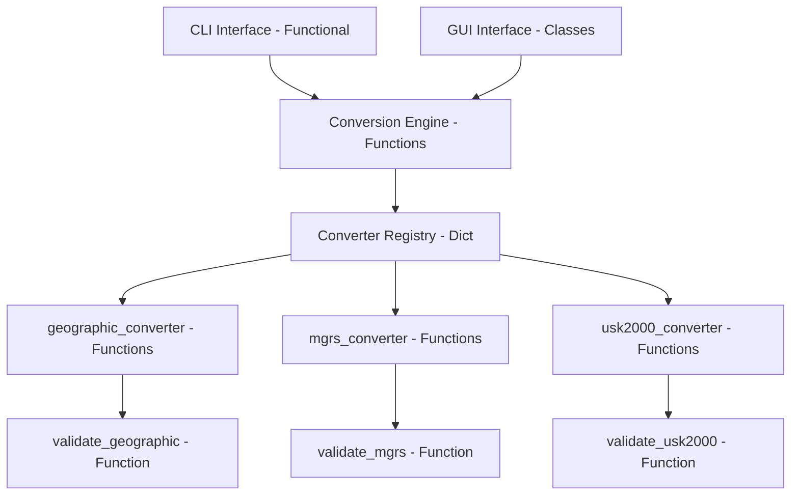

# Design Document: Coordinate Converter

## Overview

The Coordinate Converter is a Python application that transforms geographic coordinates between different coordinate systems. The system follows a modular architecture with clear separation between the conversion engine (business logic) and interface layers (CLI and GUI).

### Key Design Principles

1. **Separation of Concerns**: Conversion logic is independent of user interface implementations
2. **Functional Business Logic**: Conversion engine and converters use pure functions without state
3. **Extensibility**: New coordinate systems can be added through a registration mechanism without modifying existing code
4. **Single Conversion Operation**: Input coordinates are converted to all other supported systems simultaneously
5. **Dual Interface Support**: Both command-line and graphical interfaces share the same conversion engine
6. **Classes Only for UI**: GUI components use classes for state management; business logic remains functional

### Supported Coordinate Systems

- **Geographic Coordinates**: Latitude/longitude in two formats:
  - **Decimal Degrees**: 49.0000, 37.0000
  - **DMS (Degrees-Minutes-Seconds)**: 49°00'00.1"N 37°00'00.1"E
- **MGRS**: Military Grid Reference System
- **USK-2000**: Ukrainian Spatial Coordinate System 2000

## Architecture

### Functional vs Class-Based Design Philosophy

This application uses a **hybrid approach** that leverages the strengths of both functional and object-oriented programming:

**Business Logic (Functional)**:
- **Conversion engine**: Pure functions with no state
- **Converters**: Modules containing pure functions for validation, conversion, and formatting
- **Benefits**:
  - Easier to test (no setup/teardown, no mocking state)
  - Easier to reason about (no hidden state or side effects)
  - Better composability (functions can be combined freely)
  - No unnecessary abstraction (no state to manage)

**UI Layer (Class-Based)**:
- **GUI**: Classes for managing widget state, event handlers, and UI updates
- **Benefits**:
  - Natural fit for stateful UI components
  - Tkinter's widget-based architecture works well with classes
  - Encapsulation of UI state and behavior

**CLI (Functional)**:
- Simple functional approach with argument parsing and output formatting
- No state management needed

### High-Level Architecture



### Architectural Layers

1. **Interface Layer**: Handles user interaction
   - **CLI**: Functional approach with argument parsing and output formatting
   - **GUI**: Class-based approach for state management and widget organization
   - Parses user input
   - Formats output for display

2. **Conversion Engine**: Core business logic (pure functions)
   - Coordinates conversion operations
   - Manages converter registry (dictionary mapping system names to converter functions)
   - Orchestrates conversions from input system to all other systems
   - No state, no classes

3. **Converter Implementations**: System-specific conversion logic (pure functions)
   - Each coordinate system has a module with converter functions
   - Functions handle validation and transformation
   - No state, no classes

### Design Patterns

- **Functional Programming**: Business logic uses pure functions without side effects
- **Registry Pattern**: Dictionary maps coordinate system names to converter function modules
- **Facade Pattern**: Conversion engine provides a simplified functional interface to complex conversion operations

## Components and Interfaces

### 1. Conversion Engine (Functional)

**Responsibility**: Orchestrate coordinate conversions using a registry of converter functions.

**Implementation**: Module with pure functions and a registry dictionary.

**Interface**:
```python
# Global registry: maps system name to converter module
_converter_registry: dict[str, ConverterModule] = {}

def register_converter(system_name: str, converter_module: ConverterModule) -> None:
    """Register a coordinate system converter module"""
    _converter_registry[system_name] = converter_module

def convert(input_system: str, coordinates: dict) -> ConversionResult:
    """Convert from input_system to all other registered systems"""
    # 1. Validate input system exists
    # 2. Validate input coordinates
    # 3. Convert to geographic (intermediate format)
    # 4. Convert from geographic to all other systems
    # 5. Return ConversionResult
    
def get_supported_systems() -> list[str]:
    """Return list of all registered coordinate system names"""
    return list(_converter_registry.keys())
```

**Key Behaviors**:
- Maintains a registry dictionary of coordinate system converters
- Validates that the input system is registered
- Converts input coordinates to all other registered systems
- Returns results or error information
- No state beyond the registry dictionary

### 2. Converter Module Interface (Functional)

**Responsibility**: Define the functions that each coordinate system converter module must provide.

**Type Definition**:
```python
from typing import Protocol

class ConverterModule(Protocol):
    """Protocol defining the interface for converter modules"""
    def validate(self, coordinates: dict) -> ValidationResult: ...
    def to_geographic(self, coordinates: dict) -> GeographicCoordinates: ...
    def from_geographic(self, geo_coords: GeographicCoordinates) -> dict: ...
    def format_output(self, coordinates: dict) -> str: ...
```

**Interface**:
```python
# Each converter module (e.g., geographic.py, mgrs.py, usk2000.py) provides:

def validate(coordinates: dict) -> ValidationResult:
    """Validate coordinates for this system"""
    
def to_geographic(coordinates: dict) -> GeographicCoordinates:
    """Convert from this system to geographic coordinates"""
    
def from_geographic(geo_coords: GeographicCoordinates) -> dict:
    """Convert from geographic coordinates to this system"""
    
def format_output(coordinates: dict) -> str:
    """Format coordinates for display"""
```

**Design Rationale**: 
- Using geographic coordinates as the intermediate format simplifies the conversion matrix
- Pure functions enable easy testing and composition
- No state means no side effects or hidden dependencies
- Each converter module is a collection of related functions
- Python's Protocol type provides structural typing without inheritance

### 3. Coordinate System Converters (Functional Modules)

**Geographic Converter Module** (`converters/geographic.py`):

The geographic converter supports two input formats: decimal degrees and DMS (Degrees-Minutes-Seconds). The module uses separate parsing functions for each format with automatic format detection.

**Core Functions**:
- `validate(coordinates)`: Validates latitude (-90 to 90) and longitude (-180 to 180)
- `to_geographic(coordinates)`: Identity transformation (returns input as GeographicCoordinates)
- `from_geographic(geo_coords)`: Identity transformation (returns geo_coords as dict)
- `format_output(coordinates)`: Formats output showing both decimal and DMS representations

**Format Parsing Functions**:
- `detect_format(input_string: str) -> str`: Auto-detects whether input is "decimal" or "dms" format
  - Decimal format: Contains only numbers, dots, commas, spaces, minus signs
  - DMS format: Contains degree symbols (°), minute marks ('), second marks ("), direction letters (N/S/E/W)
  
- `parse_decimal(input_string: str) -> tuple[float, float]`: Parses decimal degree format
  - Accepts: "49.0000, 37.0000" or "49.0000 37.0000"
  - Returns: (latitude, longitude) as floats
  - Raises: ValueError if format is invalid
  
- `parse_dms(input_string: str) -> tuple[float, float]`: Parses DMS format
  - Accepts: "49°00'00.1\"N 37°00'00.1\"E" or similar variations
  - Converts to decimal degrees internally
  - Returns: (latitude, longitude) as floats
  - Raises: ValueError if format is invalid
  
- `decimal_to_dms(latitude: float, longitude: float) -> str`: Converts decimal to DMS format
  - Returns formatted string: "49°00'00.1\"N 37°00'00.1\"E"
  
- `dms_to_decimal(dms_string: str) -> tuple[float, float]`: Converts DMS to decimal
  - Helper function used by `parse_dms()`

**Format Detection Logic**:
```python
def detect_format(input_string: str) -> str:
    """Detect if input is decimal or DMS format"""
    if '°' in input_string or "'" in input_string or '"' in input_string:
        return "dms"
    return "decimal"
```

**Output Format**:
The `format_output()` function displays both representations:
```
Geographic (Decimal): Lat: 49.000000, Lon: 37.000000
Geographic (DMS): 49°00'00.0"N 37°00'00.0"E
```

**MGRS Converter Module** (`converters/mgrs.py`):
- `validate(coordinates)`: Validates MGRS string format (grid zone, square, easting, northing)
- `to_geographic(coordinates)`: Uses mgrs library for conversion
- `from_geographic(geo_coords)`: Uses mgrs library for conversion
- `format_output(coordinates)`: Formats as standard MGRS string

**USK-2000 Converter Module** (`converters/usk2000.py`):
- `validate(coordinates)`: Validates USK-2000 coordinate format
- `to_geographic(coordinates)`: Uses pyproj library with EPSG:5561 for conversion
- `from_geographic(geo_coords)`: Uses pyproj library with EPSG:5561 for conversion
- `format_output(coordinates)`: Formats according to USK-2000 conventions

### 4. CLI Interface (Functional)

**Responsibility**: Provide command-line access to coordinate conversion using functional approach.

**Implementation**: Module with functions for argument parsing and execution.

**Interface**:
```python
def parse_arguments(args: list[str]) -> CLIArguments:
    """Parse command-line arguments"""
    
def execute(args: CLIArguments) -> None:
    """Execute conversion and display results"""
    
def main() -> None:
    """Entry point for CLI"""
```

**Command-Line Flags**:
- `-g LAT LON` or `-g "DMS_STRING"`: Input as geographic coordinates (supports both decimal and DMS formats)
  - Decimal example: `-g 49.0000 37.0000`
  - DMS example: `-g "49°00'00.1\"N 37°00'00.1\"E"`
- `-m MGRS_STRING`: Input as MGRS coordinates
- `-u USK_COORDS`: Input as USK-2000 coordinates

**Geographic Input Handling**:
The CLI automatically detects the format of geographic input:
- If input contains degree symbols (°), quotes ('), or direction letters, it's treated as DMS
- Otherwise, it's treated as decimal degrees
- Both formats are converted to internal GeographicCoordinates representation

**Output Format**:
```
Geographic (Decimal): Lat: 49.000000, Lon: 37.000000
Geographic (DMS): 49°00'00.0"N 37°00'00.0"E
MGRS: 33UXP1234567890
USK-2000: X=1234567.89, Y=9876543.21
```

### 5. GUI Interface (Class-Based)

**Responsibility**: Provide graphical access to coordinate conversion using Tkinter with ttkbootstrap.

**Implementation**: Classes for state management and widget organization.

**Components**:
- **CoordinateConverterApp**: Main application class managing window and state
- **Input System Selector**: Dropdown/radio buttons to select input coordinate system
- **Dynamic Input Fields**: Input fields that change based on selected system
  - Geographic: 
    - **Option 1**: Two separate fields (Latitude, Longitude) for decimal input
    - **Option 2**: Single field for DMS input with format example
    - **Format toggle**: Radio buttons or dropdown to switch between decimal and DMS input modes
  - MGRS: One field (MGRS String)
  - USK-2000: Fields appropriate for USK-2000 format
- **Convert Button**: Triggers conversion operation
- **Output Display Area**: Shows all converted coordinate systems (geographic shown in both decimal and DMS)
- **Error Display Area**: Shows validation or conversion errors

**Geographic Input Modes**:
The GUI provides two input modes for geographic coordinates:
1. **Decimal Mode**: Two input fields for latitude and longitude as decimal numbers
2. **DMS Mode**: Single input field accepting DMS format (e.g., "49°00'00.1"N 37°00'00.1"E")

Users can switch between modes using radio buttons or a dropdown selector.

**Class Structure**:
```python
class CoordinateConverterApp:
    def __init__(self, root):
        """Initialize GUI components and state"""
        self.root = root
        self.selected_system = tk.StringVar()
        self.geographic_input_mode = tk.StringVar(value="decimal")  # "decimal" or "dms"
        self.input_fields = {}
        self.setup_ui()
    
    def setup_ui(self):
        """Create and layout all widgets"""
        
    def on_system_change(self, event):
        """Handle input system selection change"""
        
    def on_geographic_mode_change(self):
        """Handle geographic input mode change (decimal <-> DMS)"""
        
    def on_convert_click(self):
        """Handle convert button click"""
        
    def display_results(self, result: ConversionResult):
        """Display conversion results in output area"""
        
    def display_error(self, error_message: str):
        """Display error message in error area"""
```

**Layout**:
```
┌─────────────────────────────────────┐
│  Input System: [Dropdown ▼]        │
├─────────────────────────────────────┤
│  Geographic Format (if geographic): │
│  ( ) Decimal  ( ) DMS               │
├─────────────────────────────────────┤
│  Input Fields (dynamic)             │
│  [Field 1]  [Field 2]              │
│  or                                 │
│  [DMS String Field]                 │
├─────────────────────────────────────┤
│  [Convert Button]                   │
├─────────────────────────────────────┤
│  Output:                            │
│  Geographic (Decimal): ...          │
│  Geographic (DMS): ...              │
│  MGRS: ...                          │
│  USK-2000: ...                      │
├─────────────────────────────────────┤
│  Errors: (if any)                   │
└─────────────────────────────────────┘
```

## Data Models

Data models use Python dataclasses for immutable data structures (not for behavior or state management).

### GeographicCoordinates

```python
@dataclass(frozen=True)
class GeographicCoordinates:
    latitude: float   # Range: -90 to 90 (always stored as decimal degrees internally)
    longitude: float  # Range: -180 to 180 (always stored as decimal degrees internally)
    
    def to_dms(self) -> str:
        """Convert to DMS format string"""
        # Returns format like "49°00'00.1"N 37°00'00.1"E"
        pass
```

**Note**: Geographic coordinates are always stored internally as decimal degrees. DMS format is used only for input parsing and output formatting.

### ConversionResult

```python
@dataclass(frozen=True)
class ConversionResult:
    success: bool
    input_system: str
    conversions: dict[str, str]  # system_name -> formatted_output
    error_message: Optional[str] = None
```

### ValidationResult

```python
@dataclass(frozen=True)
class ValidationResult:
    valid: bool
    error_message: Optional[str] = None
```

### CLIArguments

```python
@dataclass(frozen=True)
class CLIArguments:
    input_system: str  # 'geographic', 'mgrs', or 'usk2000'
    coordinates: dict  # System-specific coordinate data
```

**Note**: All dataclasses use `frozen=True` to ensure immutability, supporting the functional programming approach.

## Correctness Properties

*A property is a characteristic or behavior that should hold true across all valid executions of a system—essentially, a formal statement about what the system should do. Properties serve as the bridge between human-readable specifications and machine-verifiable correctness guarantees.*


### Property 1: Round-trip conversion preserves coordinates

*For any* valid coordinates in any supported coordinate system, converting to any other system and then converting back to the original system SHALL produce values within acceptable tolerance (0.000001 degrees for geographic, 1 meter for MGRS and USK-2000) of the original input.

**Validates: Requirements 7.1**

### Property 2: Conversion completeness and validity

*For any* valid coordinates in any supported coordinate system, converting from that system SHALL produce valid coordinates in all other supported systems, and the output SHALL contain exactly those other systems (excluding the input system).

**Validates: Requirements 1.1, 1.2, 1.3, 1.4, 8.4**

### Property 3: Invalid input error handling

*For any* invalid coordinates in any coordinate system (e.g., latitude > 90, malformed MGRS string, out-of-bounds USK-2000), the conversion SHALL fail gracefully and return a descriptive error message indicating the validation failure.

**Validates: Requirements 2.1, 2.2, 2.3**

### Property 4: Output format correctness

*For any* valid coordinates in any supported coordinate system, the formatted output SHALL be human-readable plain text, include coordinate system labels for all converted systems, maintain precision appropriate for each system (at least 6 decimal places for geographic coordinates), and follow the formatting conventions of each coordinate system.

**Validates: Requirements 7.2, 7.3, 8.1, 8.2, 8.3**

### Property 5: CLI interface conversion correctness

*For any* valid coordinates provided via CLI with the appropriate flag (-g, -m, or -u), the CLI SHALL output plain text conversions to all other supported systems with correct formatting and system labels.

**Validates: Requirements 4.1, 4.2, 4.3, 4.6**

### Property 6: GUI conversion correctness

*For any* valid coordinates entered in the GUI with any selected input system, initiating conversion SHALL display all other coordinate systems in the output area with correct values and formatting.

**Validates: Requirements 5.5**

### Property 7: GUI error display

*For any* invalid coordinates entered in the GUI, initiating conversion SHALL display an error message in the interface describing the validation failure.

**Validates: Requirements 5.6**

### Property 8: Extensibility through registration

*For any* new coordinate system converter that is registered with the conversion engine, the engine SHALL support conversions to and from that system, and the system SHALL appear in the list of supported systems and in conversion outputs.

**Validates: Requirements 6.2**

### Property 9: DMS format round-trip preserves coordinates

*For any* valid geographic coordinates in decimal format, converting to DMS format and then parsing back to decimal SHALL produce values within acceptable tolerance (0.000001 degrees) of the original input.

**Validates: Requirements 7.1, 7.2**

## Error Handling

### Error Categories

1. **Validation Errors**: Invalid coordinate values for a given system
   - Geographic (Decimal): Latitude outside [-90, 90] or longitude outside [-180, 180]
   - Geographic (DMS): Malformed DMS string (invalid degrees/minutes/seconds format, missing direction indicators)
   - MGRS: Malformed MGRS string (invalid grid zone, square, or coordinate format)
   - USK-2000: Coordinates outside valid bounds for Ukraine

2. **Format Detection Errors**: Unable to parse geographic input
   - Ambiguous format that doesn't match decimal or DMS patterns
   - Mixed format elements

3. **System Errors**: Unsupported coordinate system specified
   - Return error message listing all supported systems

4. **Conversion Errors**: Mathematical conversion failures
   - Coordinates that cannot be represented in target system
   - Numerical precision issues

### Error Handling Strategy

**Validation Phase**:
- Each converter validates input before attempting conversion
- Validation returns a `ValidationResult` with success flag and error message
- Validation errors are caught before any conversion attempt

**Conversion Phase**:
- Conversion operations wrapped in try-except blocks
- Library-specific exceptions (mgrs, pyproj) caught and translated to user-friendly messages
- Partial conversion failures: If conversion to one system fails, continue with others and report the failure

**Error Message Format**:
```
Error: Invalid geographic coordinates (DMS format)
Details: Unable to parse DMS string "49°00'00.1N" - missing direction indicator for longitude
```

or

```
Error: Invalid geographic coordinates (Decimal format)
Details: Latitude 95.0 is outside valid range [-90, 90]
```

**Interface-Specific Error Handling**:
- **CLI**: Print error message to stderr and exit with non-zero status code
- **GUI**: Display error message in dedicated error display area, keep interface responsive

### Error Recovery

- No automatic retry mechanisms (conversions are deterministic)
- User must correct input and retry
- GUI maintains input values after error for easy correction
- CLI provides usage instructions with error messages

## Testing Strategy

### Overview

The coordinate converter will use a dual testing approach:
- **Property-based tests**: Verify universal properties across many generated inputs
- **Unit tests**: Verify specific examples, edge cases, and error conditions

### Property-Based Testing

**Library**: Hypothesis (Python property-based testing library)

**Configuration**:
- Minimum 100 iterations per property test
- Each test tagged with comment referencing design property
- Tag format: `# Feature: coordinate-converter, Property {number}: {property_text}`

**Property Test Implementation**:

1. **Property 1 - Round-trip conversion**
   - Generate random valid coordinates in each system
   - Convert to each other system and back
   - Assert values within tolerance
   - Tag: `# Feature: coordinate-converter, Property 1: Round-trip conversion preserves coordinates`

2. **Property 2 - Conversion completeness**
   - Generate random valid coordinates in each system
   - Convert and verify all other systems present in output
   - Verify each output system has valid coordinates
   - Tag: `# Feature: coordinate-converter, Property 2: Conversion completeness and validity`

3. **Property 3 - Invalid input handling**
   - Generate invalid coordinates (out of bounds, malformed)
   - Verify error messages returned
   - Tag: `# Feature: coordinate-converter, Property 3: Invalid input error handling`

4. **Property 4 - Output format**
   - Generate random valid coordinates
   - Verify output is plain text with labels and correct precision
   - Tag: `# Feature: coordinate-converter, Property 4: Output format correctness`

5. **Property 5 - CLI interface**
   - Generate random valid coordinates
   - Invoke CLI with appropriate flags
   - Verify output format and content
   - Tag: `# Feature: coordinate-converter, Property 5: CLI interface conversion correctness`

6. **Property 6 - GUI conversion**
   - Generate random valid coordinates
   - Simulate GUI conversion
   - Verify output display
   - Tag: `# Feature: coordinate-converter, Property 6: GUI conversion correctness`

7. **Property 7 - GUI error display**
   - Generate invalid coordinates
   - Simulate GUI conversion
   - Verify error display
   - Tag: `# Feature: coordinate-converter, Property 7: GUI error display`

8. **Property 8 - Extensibility**
   - Create mock converter
   - Register with engine
   - Verify it's used in conversions
   - Tag: `# Feature: coordinate-converter, Property 8: Extensibility through registration`

9. **Property 9 - DMS format round-trip**
   - Generate random valid decimal coordinates
   - Convert to DMS format
   - Parse DMS back to decimal
   - Assert values within tolerance
   - Tag: `# Feature: coordinate-converter, Property 9: DMS format round-trip preserves coordinates`

**Custom Generators**:
- `valid_geographic_coordinates()`: Generates lat in [-90, 90], lon in [-180, 180] as decimal
- `valid_geographic_dms()`: Generates valid DMS format strings
- `valid_mgrs_coordinates()`: Generates valid MGRS strings
- `valid_usk2000_coordinates()`: Generates valid USK-2000 coordinates
- `invalid_geographic_coordinates()`: Generates out-of-bounds decimal values
- `invalid_geographic_dms()`: Generates malformed DMS strings
- `invalid_mgrs_coordinates()`: Generates malformed MGRS strings
- `invalid_usk2000_coordinates()`: Generates invalid USK-2000 values

### Unit Testing

**Purpose**: Test specific examples, edge cases, and integration points

**Test Cases**:

1. **Specific Coordinate Examples**
   - Test known coordinate conversions (e.g., Kyiv city center)
   - Verify against manually calculated or reference values
   - Test both decimal and DMS input formats for geographic coordinates

2. **DMS Format Parsing**
   - Test various valid DMS formats (with/without spaces, different separators)
   - Test edge cases: 0°, 90°N, 180°E, etc.
   - Test invalid DMS formats (missing components, invalid characters)
   - Test format detection logic (decimal vs DMS)

3. **DMS to Decimal Conversion**
   - Test known DMS to decimal conversions
   - Test fractional seconds in DMS format
   - Test all four quadrants (N/S, E/W combinations)

4. **Decimal to DMS Conversion**
   - Test known decimal to DMS conversions
   - Test negative coordinates (should convert to S/W directions)
   - Test precision in DMS output (seconds with decimal places)

5. **Edge Cases**
   - Coordinates at system boundaries (poles, date line, grid zone edges)
   - Minimum and maximum valid values
   - Zero values
   - DMS at exactly 0 seconds, 0 minutes

6. **CLI Argument Parsing**
   - Test with no arguments (should show usage)
   - Test with multiple flags (should error)
   - Test with unsupported flag (should error)
   - Test -g flag with decimal format
   - Test -g flag with DMS format (quoted string)

7. **GUI Component Tests**
   - Test input field visibility changes when system selected
   - Test geographic format mode switching (decimal <-> DMS)
   - Test button click handlers
   - Test output area updates (should show both decimal and DMS)

8. **Error Message Content**
   - Verify specific error messages for known invalid inputs
   - Verify unsupported system error lists all supported systems
   - Verify DMS parsing errors are descriptive

9. **Precision Tests**
   - Verify geographic coordinates maintain 6+ decimal places
   - Verify DMS format maintains appropriate precision in seconds
   - Verify MGRS precision appropriate for grid square size
   - Verify USK-2000 precision in meters

### Integration Testing

**Scope**: Test complete workflows through both interfaces

**Test Scenarios**:
1. End-to-end CLI conversion for each supported system
2. End-to-end GUI conversion for each supported system
3. Adding a new coordinate system and verifying it works in both interfaces

### Test Coverage Goals

- 100% coverage of conversion engine core logic
- 100% coverage of validator implementations
- 90%+ coverage of interface layers (CLI and GUI)
- All acceptance criteria validated by at least one test

### Testing Dependencies

- **pytest**: Test framework
- **hypothesis**: Property-based testing
- **mgrs**: MGRS conversion library (also used in production)
- **pyproj**: Projection library (also used in production)
- **unittest.mock**: For mocking in unit tests

## Implementation Notes

### Technology Stack

- **Language**: Python 3.10+
- **CLI Framework**: argparse (standard library) - functional implementation
- **GUI Framework**: Tkinter (standard library) with ttkbootstrap - class-based implementation
- **Conversion Libraries**:
  - `mgrs`: MGRS coordinate conversions
  - `pyproj`: Projection transformations for USK-2000 (EPSG:5561)

### Conversion Strategy

All conversions use geographic coordinates (WGS84) as the intermediate format:
- Input system → Geographic → Target system(s)

This approach:
- Reduces conversion complexity from O(n²) to O(n)
- Leverages well-tested libraries for each system
- Simplifies adding new coordinate systems
- Works naturally with pure functions (no state needed)

### Geographic Coordinate Format Support

**Internal Representation**: All geographic coordinates are stored internally as decimal degrees (float values).

**Input Formats**:
1. **Decimal Degrees**: `49.0000, 37.0000` or `49.0000 37.0000`
2. **DMS (Degrees-Minutes-Seconds)**: `49°00'00.1"N 37°00'00.1"E`

**DMS Format Specification**:
- **Degrees**: Integer followed by ° symbol
- **Minutes**: Integer (0-59) followed by ' symbol
- **Seconds**: Float (0.0-59.999...) followed by " symbol
- **Direction**: Single letter (N/S for latitude, E/W for longitude)
- **Spacing**: Flexible (spaces between components are optional)
- **Examples**:
  - `49°00'00.1"N 37°00'00.1"E`
  - `49°0'0.1"N 37°0'0.1"E` (leading zeros optional)
  - `49° 00' 00.1" N 37° 00' 00.1" E` (with spaces)

**Format Detection**:
- Presence of °, ', or " characters indicates DMS format
- Otherwise, decimal format is assumed

**Output Format**:
Geographic coordinates are always output in BOTH formats:
```
Geographic (Decimal): Lat: 49.000028, Lon: 37.000028
Geographic (DMS): 49°00'00.1"N 37°00'00.1"E
```

**Conversion Functions**:
- `parse_decimal()`: Parses "49.0000, 37.0000" → (49.0, 37.0)
- `parse_dms()`: Parses "49°00'00.1"N 37°00'00.1"E" → (49.000028, 37.000028)
- `decimal_to_dms()`: Converts (49.000028, 37.000028) → "49°00'00.1"N 37°00'00.1"E"
- `detect_format()`: Auto-detects input format

### Functional Programming Benefits

**Why Functions Instead of Classes for Business Logic**:

1. **No State to Manage**: Coordinate conversions are pure transformations - input coordinates produce output coordinates with no side effects
2. **Simpler Testing**: Pure functions are easier to test (no setup, no mocking, no state management)
3. **Better Composability**: Functions can be easily composed and reused
4. **Clearer Intent**: Function signatures clearly show inputs and outputs
5. **No Unnecessary Abstraction**: Classes add complexity when there's no state to encapsulate

**Registry Implementation**:
```python
# Simple dictionary mapping system names to converter modules
_converter_registry: dict[str, ConverterModule] = {}

# At startup:
import converters.geographic as geographic
import converters.mgrs as mgrs
import converters.usk2000 as usk2000

register_converter("geographic", geographic)
register_converter("mgrs", mgrs)
register_converter("usk2000", usk2000)
```

**Converter Module Pattern**:
Each converter is a Python module (file) containing the required functions:
- `validate(coordinates: dict) -> ValidationResult`
- `to_geographic(coordinates: dict) -> GeographicCoordinates`
- `from_geographic(geo_coords: GeographicCoordinates) -> dict`
- `format_output(coordinates: dict) -> str`

### Precision and Tolerance

**Geographic Coordinates**:
- Internal precision: Python float (64-bit)
- Display precision: 6 decimal places (~0.11 meters at equator)
- Round-trip tolerance: 0.000001 degrees (~0.11 meters)

**MGRS**:
- Precision depends on coordinate length (10-digit = 1 meter)
- Round-trip tolerance: 1 meter

**USK-2000**:
- Internal precision: Python float
- Display precision: 2 decimal places (centimeters)
- Round-trip tolerance: 1 meter

### Extensibility Implementation

**Adding a New Coordinate System**:

1. Create a new converter module with the required functions
2. Implement `validate()`, `to_geographic()`, `from_geographic()`, `format_output()`
3. Register the converter module with the engine at startup
4. No changes needed to CLI or GUI code (they query supported systems dynamically)

**Example** (`converters/utm.py`):
```python
def validate(coordinates: dict) -> ValidationResult:
    """Validate UTM zone, easting, northing"""
    # Validation logic
    pass

def to_geographic(coordinates: dict) -> GeographicCoordinates:
    """Convert UTM to geographic using pyproj"""
    # Conversion logic
    pass

def from_geographic(geo_coords: GeographicCoordinates) -> dict:
    """Convert geographic to UTM using pyproj"""
    # Conversion logic
    pass

def format_output(coordinates: dict) -> str:
    """Format as 'Zone 33N, E: 500000, N: 4649776'"""
    # Formatting logic
    pass

# In main initialization code:
import converters.utm as utm_converter
register_converter("utm", utm_converter)
```

### GUI Implementation Details

**Dynamic Input Fields**:
- Use Tkinter grid layout with row/column management
- Clear and recreate input fields when system selection changes
- For geographic coordinates, provide mode selector (decimal vs DMS)
- Maintain field values during system switches when possible
- Show format hints/examples for DMS input

**Geographic Input Mode Switching**:
- Radio buttons to toggle between "Decimal" and "DMS" modes
- Decimal mode: Two separate entry fields (Latitude, Longitude)
- DMS mode: Single entry field with placeholder text showing format example
- Mode selection persists during session

**Output Display**:
- Geographic coordinates always shown in both formats (decimal and DMS)
- Other coordinate systems shown in their native formats
- Clear labels for each coordinate system
- Monospace font for coordinate values to improve readability

**Styling with ttkbootstrap**:
- Use modern theme (e.g., "cosmo", "darkly")
- Consistent padding and spacing
- Clear visual hierarchy (input → action → output)
- Format example text in lighter color to distinguish from input

**Responsiveness**:
- Conversion runs in main thread (fast enough for UI)
- Disable convert button during conversion to prevent double-clicks
- Clear error messages before new conversion attempt
- Provide immediate feedback for format detection

### File Structure

```
coordinate_converter/
├── __init__.py
├── core/
│   ├── __init__.py
│   ├── engine.py              # Conversion engine functions and registry
│   └── models.py              # Data models (dataclasses)
├── converters/
│   ├── __init__.py
│   ├── geographic.py          # Geographic converter functions
│   │                          # - detect_format(), parse_decimal(), parse_dms()
│   │                          # - decimal_to_dms(), dms_to_decimal()
│   │                          # - validate(), to_geographic(), from_geographic(), format_output()
│   ├── mgrs.py                # MGRS converter functions
│   └── usk2000.py             # USK-2000 converter functions
├── interfaces/
│   ├── __init__.py
│   ├── cli.py                 # CLI implementation (functional)
│   └── gui.py                 # GUI implementation (class-based)
└── tests/
    ├── __init__.py
    ├── test_properties.py     # Property-based tests
    ├── test_converters.py     # Unit tests for converters
    ├── test_dms_parsing.py    # Unit tests for DMS format parsing
    ├── test_cli.py            # CLI tests
    └── test_gui.py            # GUI tests
```

## Dependencies

### Production Dependencies

- `mgrs>=1.4.0`: MGRS coordinate conversions
- `pyproj>=3.4.0`: Coordinate system transformations
- `ttkbootstrap>=1.10.0`: Modern Tkinter themes

### Development Dependencies

- `pytest>=7.0.0`: Testing framework
- `hypothesis>=6.0.0`: Property-based testing
- `pytest-cov>=4.0.0`: Coverage reporting

## Future Enhancements

### Potential Additional Coordinate Systems

- **UTM** (Universal Transverse Mercator)
- **Gauss-Krüger** (Used in Eastern Europe)
- **British National Grid**
- **Irish Grid**

### Potential Features

- **Batch Conversion**: Convert multiple coordinates from a file
- **Coordinate Format Detection**: Auto-detect input format without requiring flag
- **Precision Control**: Allow user to specify output precision
- **Export Options**: Save results to file (CSV, JSON, KML)
- **Map Visualization**: Display coordinates on a map
- **Coordinate Validation Service**: API endpoint for validation

### Performance Considerations

- Current design optimized for single coordinate conversions
- For batch processing, consider:
  - Vectorized operations using NumPy
  - Parallel processing for large datasets
  - Caching of projection objects (pyproj)

---

**Document Version**: 1.0  
**Last Updated**: 2025-01-XX  
**Status**: Ready for Review
